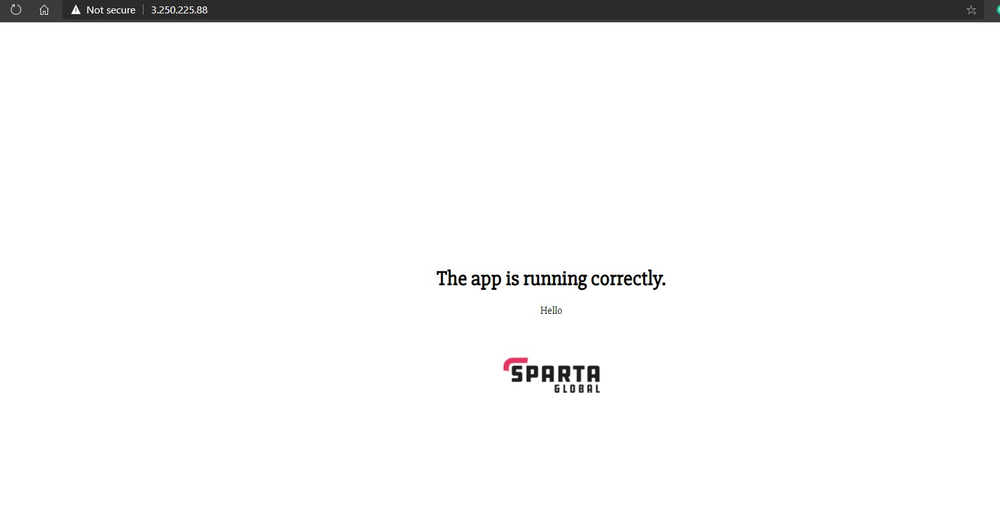
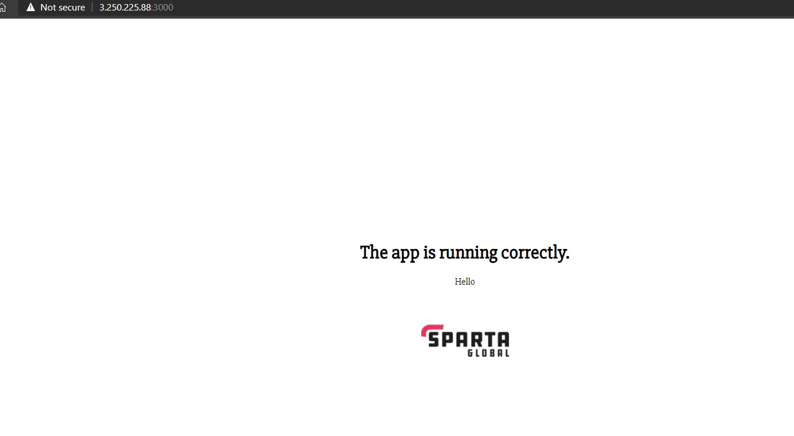
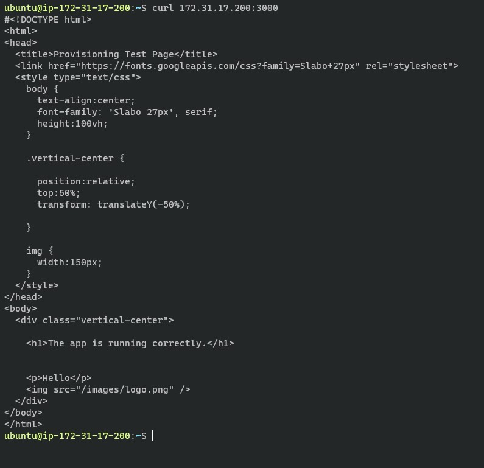

# AWS

## What is the cloud?
- Cloud computing is really just accessing some remote computer and using it's resources as your own. It is both cost-efficient and convenient as an option as it reduces capital and operational costs whilst allowing one to access it anywhere they want.

<br>

## What is AWS?
- It's a subsidiary of Amazon that provides on-demand cloud computing, storage, networking, database, analytics and more. It does so through the use of many data centres around the world. As they are the most popular choice of cloud-based services, they are globally available and prove to be versatile in their applications too.

<br>

## What is EC2?
- EC2 stands for "Elastic Compute Cloud". It's a service that AWS provides allowing their users to access virtual computers for the running of applications, for example. Users can choose where to base their computers from. Also, EC2 allows users to create, launch and terminate instances as needed, only paying for the active servers they have (thus the term "elastic").

<br>

## What is a Security Group? How do you open a port to your IP? How do you open it to the world?
- A security group (SG) acts as a virtual firewall for EC2 instances to control incoming and outgoing traffic. When launching instances, you can specify which security groups to add thus choosing who can access your instance etc.

- To open a port to your IP, you will need to either create a new security group or change an existing one. Inside it, you can specify which type of connection you can allow. For example, `HTTP` will by default use port 80 and `SSH` uses port 22.

- To open a specific port to your IP you will need to choose a `Type`. For specific ports you can use `Custom TCP` and input the port you want. Finally, in `Source Type` you can select `My IP`.

- To open ports to the world, you will need to specify the `Source` as `0.0.0.0`

<br>

## Why should we not have port 22 open to all IP's?
- Port 22 is the default port used for secure logins. If you leave it open for the world, you will be allowing access of it to anyone. They can then change it however they feel, which is extremely dangerous.

<br>

## Where do you keep SSH keys?
- By default, SSH keys are kept in a folder called `.ssh`
> The path to this folder is `~/.ssh` where `~` is the home directory

<br>

## How to SSH into a remote server on AWS?
- When you create an instance in EC2, you get the option of creating your own private key pair. When you do so, you must download a `.pem` file which you should then move into your `.ssh` file for safekeeping.

- To SSH into the instance, you must run the following command:
```bash
ssh -i path-to-pem-file ubuntu@ip-address
```
> For example, `ssh -i ~/.ssh/aws.pem ubuntu@192.168.10.100

<br>

## How can you send a file into a remote server
- We can use a program called `scp` or 'Secure Copy`.

- Within our host machine, if we wanted to copy over a file into our instance, we can use the first line while copying over a directory requires us to do so recursively as in the second line. Finally we can also send multiple files at once, it is just the same syntax but add multiple files, as shown in the third line

```bash
$ scp -i path-to-pem-file path-to-file user@remoteip:/path/file2
$ scp -i path-to-pem-file -r path-to-directory user@remoteip:/path/file2
$ scp -i path-to-pem-file path-to-file1 path-to-file2 path-to-file3 user@remoteip:/path/file2
```
> For a file example `scp -i ~/.ssh provision.sh ubuntu:192.168.10.100`

> For a directory example `scp -i ~/.ssh -r ./app ubuntu:192.168.10.100`

> For a multiple files example `scp -i ~/.ssh provision1.sh provision2.sh ubuntu:192.168.10.100`
<br>

## General outline to get the app working
- To get a NodeJS app working, we will need to do some configuring. Firstly, we need to ensure the necessary packages for the app to work are installed. The main ones are listed below:
    1. `nodejs`
    2. `pm2`
    3. `nginx`

- We will then need to navigate to the directory where the `package.json` file is found. When there, you will need to install the dependencies via `npm install`.

- Finally, start the app using `pm2 start app.js`

- To get the app working on port 80 we will need to configure `nginx` as a reverse proxy.

- We will first need to `cd /etc/nginx/sites-available`. Once here we need to create a new config file for nginx, we can do so using `sudo nano new-config.conf` (or indeed whatever name you want, it just needs an extension of `.conf`). Within this file you will need to put:
```
server {
    listen 80;
    location / {
        proxy_pass         http://<ip_address>:3000;
    }
}
```
> Indeed you must put the private IPv4 address of your instance in the place shown above

-  Then we need to remove the default config file via `sudo rm /etc/nginx/sites-enabled/default`

- Finally, we need to restart nginx using `sudo systemctl restart nginx`


## What you should get

- Here is the app running on port 80



- Here it is running on port 3000



- We can also see the app running on the instance's private IP using `curl <ip>`. When we do so, we receive the static HTML page our browser would have normally received.



---
**Used:**
- [Security Groups](https://docs.aws.amazon.com/AWSEC2/latest/UserGuide/ec2-security-groups.html)